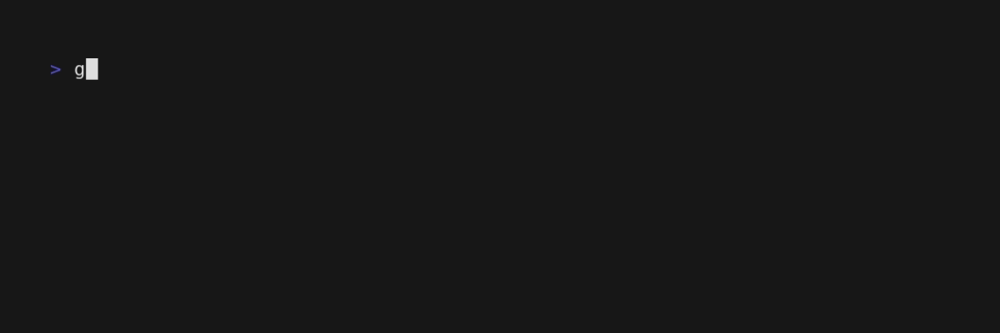

<h1 align="center">
   
  
   
  Honeydew
   
</h1>

<h4 align="center">A collection of homemade tui components for the Bubble Tea framework.</h4>

  <a href="#button">Button</a> •
  <a href="#selector">Selector</a>

## Button

A button, useful for sending a callback message for "pressed" input.

- [Example code, basic button](https://github.com/AndrewVota/honeydew/blob/main/examples/button/button.go)

## Selector

A selector, useful for scrolling over a list of elements to choose one.

- [Example code, basic selector](https://github.com/AndrewVota/honeydew/blob/main/examples/selector/selector.go)
